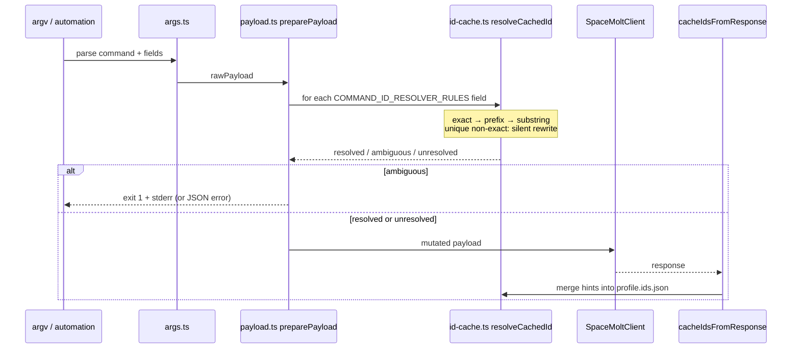
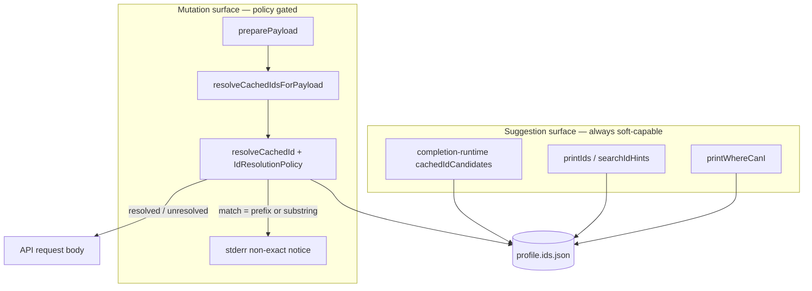
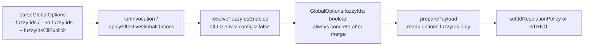
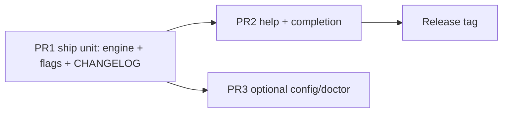

# Strict ID-Cache Payload Resolution (Stop Silent Soft Rewrites)

| Field | Value |
| --- | --- |
| **Author** | spacemolt-cli maintainers |
| **Date** | 2026-07-24 |
| **Status** | Draft (revised after review) |
| **Repo** | `/home/spacemolt/spacemolt-cli-source` |
| **Incident** | 2026-07-24 — `find_route haven` → `crosshaven` via unique substring |
| **Primary path (this deliverable)** | `/tmp/grok-1000/grok-design-doc-7582d9ac.md` |
| **Recommended permanent path** | `docs/superpowers/specs/2026-07-24-id-cache-strict-payload-resolution-design.md` |
| **Related designs** | `docs/superpowers/specs/2026-06-09-fuzzy-jq-resolution-design.md` (`--fuzzy` is **jq-only**); `docs/superpowers/specs/2026-07-12-exact-profile-isolation-design.md` (exact identity over silent fuzzy) |

---

## Overview

SpaceMolt CLI silently rewrites request payload fields using the per-profile ID cache (`*.ids.json`) before any API call. Resolution is `exact → prefix → substring`; a **unique** non-exact hit is accepted with **no stderr warning**. On 2026-07-24 this misrouted automation: profiles whose cache contained `crosshaven` but not `haven` rewrote `find_route haven` / `jump haven` to `{"id":"crosshaven"}`, burning hours until destination checks failed.

This design separates **suggestion surfaces** (completion, `ids`, discovery UX) from **payload mutation**, makes **exact match the default for all payload rewrites**, and makes soft match (prefix / substring) an **explicit opt-in** via `--fuzzy-ids` / env / config — with **kind-tiered** rules so `system` and `poi` never use silent substring even when soft match is enabled. Non-exact rewrites that still occur always emit one stderr notice (unless `--quiet`).

**“Exact” always includes unique normalized matches on either `hint.id` or `hint.name`** (same as today’s exact stage in `findMatches`). Name-exact rewrites such as `travel earth` → `sol_earth` remain always-on under strict mode; they are not soft match.

**`--fuzzy-ids` does not reintroduce `haven` → `crosshaven`:** system/poi soft policy allows unique prefix only, never substring. `haven` is not a prefix of `crosshaven`.

This is the **upstream product fix** for our own CLI, not a tools-side mitigation. Tools may keep seed/validate defenses as defense-in-depth.

**Ship unit (blocking):** The all-kinds exact default must land in the **same change set** as user-facing soft restore (`--fuzzy-ids` / env / config) and a CHANGELOG breaking note. Do not merge full strict invert without a documented restore path.

---

## Background & Motivation

### Production incident (2026-07-24)

| Observation | Detail |
| --- | --- |
| Symptom | `find_route haven` / `jump haven` sent wrong destination for some profiles |
| Harlan profile | Cache had `crosshaven`, no exact `haven` → payload became `{"id":"crosshaven"}` |
| Sacagawea profile | Exact `haven` present → correct |
| Station form | `find_route grand_exchange_station` OK (station token does not substring-match system hints the same way) |
| Cache saturation | Nearly all production profiles at `MAX_HINTS = 500` |
| Collision family | `dusthaven`, `glenhaven`, `millhaven`, `sunhaven`, `thornhaven`, `crosshaven` (any unique `*haven` substring wins) |

Root cause is not incomplete cache seeding alone: **unique substring is treated as correctness**. Multi-match ambiguity already hard-errors; uniqueness does not imply the token the user typed.

### What the ID cache actually does

This is **not** autocomplete. Before the HTTP request, `preparePayload` in `src/payload.ts` calls `resolveCachedIdsForPayload` → `resolveCachedId` in `src/id-cache.ts`:



Critical code paths today:

| Location | Role |
| --- | --- |
| `src/id-cache.ts` `resolveCachedId` | `exact → prefix → substring`; unique → `{ type: 'resolved', match }`; multi → `ambiguous` |
| `src/id-cache.ts` `findMatches` | Compares `normalizeSearchText(query)` against **both** `hint.id` and `hint.name` at every stage |
| `src/id-cache.ts` `COMMAND_ID_RESOLVER_RULES` | Field→kind map for `find_route`, `jump`, `travel`, `buy`/`sell`, storage, drones, ships, facilities, factions, combat, chat, … |
| `src/id-cache.ts` `idKindForCommandField` | Explicit rules first; else field-name heuristics (generated/dynamic routes use heuristics) |
| `src/payload.ts` `resolveCachedIdsForPayload` | Mutates string/array fields; only ambiguity is hard-fail; **no soft-match reporting**; **reserved path is scalar-only today** |
| `src/payload.ts` `reservedIdValue` | Pass-through exceptions: storage targets, numeric jump bearings, item `fuel` / `tank_fuel` |
| `src/id-cache.ts` `MAX_HINTS = 500` | Newest-first cap; saturated caches increase collision surface |
| `src/completion-runtime.ts` `cachedIdCandidates` | Prefix/substring for **suggestions only** (does not mutate requests) |
| `src/id-cache.ts` `searchIdHints` / `printIds` | Fuzzy list for local `ids` command |
| `src/global-options.ts` `--fuzzy` | **jq path resolution only** (`src/jq.ts`) — unrelated mechanism |
| `src/api-command-handler.ts` / `grouped-api-command-handler.ts` | Call `getRuntimeConfig(options, context?.env)` then `preparePayload(..., options, sessionPath, writer)` — **env not passed into preparePayload** |
| Tests | `id-cache.test.ts` documents `fuel` → `fuel_cell` (prefix) and `cell` → `fuel_cell` (substring) as soft UX; `id-resolver.test.ts` covers end-to-end payload rewrite including **name-exact** cases |

```548:557:src/id-cache.ts
function findMatches(hints: IdHint[], query: string, match: 'exact' | 'prefix' | 'substring'): IdHint[] {
  const normalizedQuery = normalizeSearchText(query);
  if (!normalizedQuery) return [];
  return hints.filter((hint) => {
    const values = [hint.id, hint.name || ''].map(normalizeSearchText).filter(Boolean);
    if (match === 'exact') return values.some((value) => value === normalizedQuery);
    if (match === 'prefix') return values.some((value) => value.startsWith(normalizedQuery));
    return values.some((value) => value.includes(normalizedQuery));
  });
}
```

```378:397:src/id-cache.ts
export function resolveCachedId(kind: IdKind, query: string, hints = loadIdCacheSync()): CachedIdResolveResult {
  // exact → prefix → substring (today always all three)
  // unique → resolved; multi → ambiguous; else unresolved
}
```

### Pain points

1. **Automation safety inverted.** Scripts that pass exact map tokens (`haven`) are rewritten if a longer cached ID contains that token and no exact hit exists.
2. **Silent mutation.** There is no stderr line for prefix/substring rewrites; only multi-match errors surface.
3. **Uniqueness ≠ correctness.** The resolver’s conservatism stops at “one match,” not “this token is what the user meant.”
4. **Saturated caches amplify risk.** At 500 hints, partial systems remain in cache long after exploration; short real system names become substrings of longer ones.
5. **Suggestion vs mutation coupled.** The same soft matching that makes `ids` and tab-completion pleasant is applied to the wire payload.
6. **Misleading global flag.** `--fuzzy` exists and is documented for jq; operators may assume it controls ID softness — it does not.

### Analogy to an existing design choice

`docs/superpowers/specs/2026-07-12-exact-profile-isolation-design.md` already rejected silent fuzzy identity for profiles (`arbiter47` must never resolve to `arbiter67`). This design applies the same principle to **map and entity IDs in request payloads** for prefix/substring stages — while keeping intentional exact-name→id rewrite (K13).

---

## Goals & Non-Goals

### Goals

1. **Stop silent payload rewriting** that misroutes navigation (and other kinds) when a unique soft match exists.
2. **Separate suggestion from mutation:** completion / `ids` / discovery may stay fuzzy; payload rewrite defaults to exact (id **or** name).
3. **Exact-by-default** for all `IdKind` values during payload resolution; soft match **opt-in**, available the same day strict ships.
4. **Tiered soft policy when opted in:** `system` / `poi` allow unambiguous **prefix** only — **never substring**. Other kinds may allow prefix + substring.
5. **Always report non-exact (prefix/substring) rewrites** on stderr when they occur (suppressible with `--quiet`). Exact id/name rewrites stay silent.
6. **Preserve reserved-value pass-throughs** (fuel, numeric jump bearings, storage targets, empire aliases).
7. **Preserve ambiguity hard errors** and existing machine-readable `ambiguous_cached_id` JSON errors.
8. **Clear migration** for humans and automation: flag, env, `config.json`, CHANGELOG, help — with buy/sell short-token recipes.
9. **Implementable** with tests first; no gameserver/OpenAPI change required.

### Non-Goals

- Changing OpenAPI, gameserver routing, or map ID assignment.
- Expanding or shrinking `MAX_HINTS` / cache eviction policy (may be a follow-up).
- Making shell completion require `--fuzzy-ids`.
- Reusing or overloading the existing jq `--fuzzy` flag.
- Tools-side seed/validate (may remain; not this repo’s primary fix).
- “Did you mean” interactive prompts that block non-TTY automation.
- Fuzzy typo correction (edit distance) for payload IDs.
- Changing alias normalization (`target_system` → `id`) in `args.ts`.
- **Debug-only “soft candidate existed but strict skipped” signals** (v1 non-goal; would add noise for every partial token).
- Disabling exact name→id rewrite under strict (always-on product contract — K13).

---

## Key Decisions

| # | Decision | Rationale |
| --- | --- | --- |
| **K1** | **Exact-only is the default for all payload ID rewrites** (prefix/substring off). Soft match requires opt-in. | Incident class is “automation sent exact token, CLI rewrote it.” Prefer safety for the heavy automation user base; humans can opt into convenience. |
| **K2** | Soft match is **opt-in** via `--fuzzy-ids` / `SPACEMOLT_FUZZY_IDS` / `config.json` `fuzzyIds`, with `--no-fuzzy-ids` to force off. **Not** strict-opt-out. | Automation inherits safety without env sprawl. Interactive users who want old softness set one preference. |
| **K3** | **Do not reuse `--fuzzy`.** New flag name: `--fuzzy-ids`. | Existing `--fuzzy` is jq-only (`src/jq.ts`, help text, completion metadata). Overloading would create dual semantics and regression risk. |
| **K4** | **Kind tiers when soft is enabled:** `system`/`poi` → exact + unique **prefix** only; **never substring**. All other kinds → exact + unique prefix + unique substring (today’s ladder). | System/POI IDs are full map tokens; short real systems are often substrings of longer ones (`haven` ⊂ `crosshaven`). Items (`cell` → `fuel_cell`) remain the main interactive soft-match win. **`--fuzzy-ids` does not reintroduce the incident.** |
| **K5** | When soft match is **disabled** and only prefix/substring would have hit: **pass-through original token** (`unresolved`), do not error. | Exact server IDs not present in a cold/partial cache must still work. Failing closed would break scripts that never relied on the cache. |
| **K6** | When soft match is **enabled** and unique non-exact hits: **rewrite + always emit one stderr notice** (unless `--quiet`). | Silent rewrite was what made the incident last hours. Visibility is mandatory for any remaining soft path. |
| **K7** | Ambiguity remains a **hard error** (exit 1), including under soft match. Unchanged message shape / `ambiguous_cached_id`. | Multi-match already correct; do not soften it. |
| **K8** | **Reserved values** keep bypassing soft match (and exact rewrite) as today: item `fuel`/`tank_fuel`, numeric jump bearings, storage `target` reserved words / empire aliases. | Existing tests in `id-resolver.test.ts` encode product contracts. |
| **K9** | Config precedence: **CLI flag > env > `config.json` > default (`false`)**. Merge once **before** `preparePayload`; payload path never reads env. | Matches profile precedence style; keeps unit tests free of `process.env` pollution. |
| **K10** | Completion / `ids` / `where-can-i` **keep fuzzy search** independent of `--fuzzy-ids`. | Suggestion surfaces never mutate the wire payload; they should stay convenient. |
| **K11** | Tools-side seed+validate remains **useful defense-in-depth**, not required for correctness of system tokens after this fix. | CLI no longer rewrites exact system tokens by default; tools validation still catches bad destinations and empty caches. |
| **K12** | Permanent design home under `docs/superpowers/specs/` once accepted; implementation does not depend on that copy. | Matches repo convention (`2026-07-12-exact-profile-isolation-design.md`, etc.). |
| **K13** | **Exact match always rewrites** on unique normalized equality of query vs `hint.id` **or** `hint.name` (today’s exact stage). This is **not** soft match and stays **always-on** regardless of `--fuzzy-ids`. | Name-exact is intentional interactive UX (`travel earth`, `battle_target raider`, facility names). Implementers must not code id-only exact matching. Silent for exact (no notice) — only prefix/substring notices. |
| **K14** | **Ship unit:** full all-kinds exact default + user-facing soft restore (flags/env/config) + CHANGELOG breaking note ship **together**. No main-branch window where interactive soft is impossible. | Fixes Issue: PR that only inverts default strands humans mid-release. |

---

## Proposed Design

### Conceptual model: two surfaces



### Definition of “exact” (load-bearing)

Exact is **not** “string equals wire id only.” It is the existing exact stage:

1. `normalizeSearchText(query)` — trim, lowercase, `_`/`-` → spaces, collapse spaces (`src/id-cache.ts`).
2. Compare equality against `normalizeSearchText(hint.id)` **and** `normalizeSearchText(hint.name || '')`.
3. If exactly one hint matches → `{ type: 'resolved', value: hint.id, match: 'exact' }`.
4. If multiple hints match → `ambiguous` (same as today).

| Query example | Cached hint | Stage | Under strict default |
| --- | --- | --- | --- |
| `earth` | id `sol_earth`, name `Earth` | **exact** (name) | **rewrites** → `sol_earth` (always-on, K13) |
| `ORE_IRON` | id `ore_iron` | **exact** (id, case) | **rewrites** |
| `iron` | id `ore_iron`, name `Iron Ore` | **prefix** (name) | pass-through unless `--fuzzy-ids` |
| `cell` | id `fuel_cell`, name `Fuel Cell` | **substring** | pass-through unless `--fuzzy-ids` |
| `haven` | id `crosshaven` only | **substring** | pass-through (never system substring, even soft) |
| `cro` | id `crosshaven` only | **prefix** | pass-through default; soft → rewrite + notice |
| `node_beta` | id `node_beta_industrial_station` | **prefix** (id) | pass-through unless `--fuzzy-ids` |
| `raider` | id `player-raider`, name `Raider` | **exact** (name) | **rewrites** (always-on) |

Implementers who drop name from exact matching will regress large intentional UX — treat K13 as a hard contract.

### Resolution policy

Introduce an explicit policy object rather than hard-coding the ladder inside `resolveCachedId`:

```typescript
// Proposed in src/id-cache.ts

export type IdMatchKind = 'exact' | 'prefix' | 'substring';

export interface IdResolutionPolicy {
  /** When false, only exact (id or name) and reserved/package normalization may rewrite. */
  allowPrefix: boolean;
  /** When false, substring matches are never applied to the payload. */
  allowSubstring: boolean;
}

/** Soft-match policy when options.fuzzyIds === true. */
export function softIdResolutionPolicy(kind: IdKind): IdResolutionPolicy {
  // Map tokens: never substring (K4)
  if (kind === 'system' || kind === 'poi') {
    return { allowPrefix: true, allowSubstring: false };
  }
  return { allowPrefix: true, allowSubstring: true };
}

/** Default / strict policy for all kinds (K1). Exact id/name still runs (K13). */
export const STRICT_ID_RESOLUTION_POLICY: IdResolutionPolicy = {
  allowPrefix: false,
  allowSubstring: false,
};

export function resolveCachedId(
  kind: IdKind,
  query: string,
  hints = loadIdCacheSync(),
  policy: IdResolutionPolicy = STRICT_ID_RESOLUTION_POLICY,
): CachedIdResolveResult {
  // 1. exact always (id OR name via findMatches) — K13
  // 2. if policy.allowPrefix → prefix stage (id OR name)
  // 3. if policy.allowSubstring → substring stage (id OR name)
  // 4. else unresolved (package: strip rules unchanged)
}
```

**Default behavior matrix**

| IdKind | Default (strict) | With `options.fuzzyIds === true` |
| --- | --- | --- |
| `system` | exact id/name only | exact → unique prefix; **no substring** |
| `poi` | exact id/name only | exact → unique prefix; **no substring** |
| `item`, `player`, `ship`, `faction`, `drone`, `wreck`, `facility`, `listing`, `package` | exact id/name only | exact → unique prefix → unique substring |

**Ambiguity:** at any enabled stage, `matches.length > 1` → `{ type: 'ambiguous', ... }` (unchanged).

**Unresolved under strict:** return original token (or package-normalized bare id). Payload sends what the user typed; server validates.

### Classification of current `id-resolver.test.ts` fixtures

| Fixture (summary) | Match class | Under default strict | Requires `fuzzyIds: true` |
| --- | --- | --- | --- |
| `travel` `earth` → `sol_earth` | **exact name** | stays green | no |
| `battle_target` `raider` → `player-raider` | **exact name** | stays green | no |
| `faction_invite` `marlowe` → `player-marlowe` | **exact name** | stays green | no |
| `tow_wreck` `skiff` → `wreck-1` | **exact name** | stays green | no |
| `facility_*` `"fuel bunker"` → `facility-1` | **exact name** | stays green | no |
| `list_ship_for_sale` `dust_devil` | **exact name** (name equals ship label) | stays green | no |
| `reload` ammo `laser cell` → `laser_cell` | **exact name** (normalized) | stays green | no |
| `faction_declare_war` `smc` → `faction-smc` | **exact name** (tag) | stays green | no |
| `jump` `90` reserved | reserved | stays green | no |
| `sell` `fuel` / `tank_fuel` reserved | reserved | stays green | no |
| storage reserved targets / empire aliases | reserved | stays green | no |
| package / note / forum / chat channel non-resolve | not id fields / empty rules | stays green | no |
| **Incident:** `find_route`/`jump` `haven` with only `crosshaven` | would be substring | **new:** pass-through `haven` | N/A (must not soft-substring) |
| `sell` `iron` → `ore_iron` | **prefix** (name) | needs soft | **yes** |
| `storage_*` `iron` → `ore_iron` | **prefix** | needs soft | **yes** |
| `storage_view` `station_id=node_beta` | **prefix** (id) | needs soft | **yes** |
| `load_drone` `combat` → `combat_drone` | **prefix** | needs soft | **yes** |
| `deploy_drone` `survey` → `drone-1` | **prefix** (name) | needs soft | **yes** |
| `storage_loot` `wreck_id=iron` | **prefix**/name soft | needs soft | **yes** |
| Unit: `cell` → `fuel_cell` | **substring** | needs soft | **yes** (unit soft policy) |
| Unit: `fuel` → `fuel_cell` at resolve layer | **prefix** | needs soft policy in unit tests; payload path still reserves `fuel` | unit only |

### Incident scenarios after the fix

| Command / cache | Today | After (default) | After (`--fuzzy-ids`) |
| --- | --- | --- | --- |
| `find_route haven`, cache has only `crosshaven` | → `crosshaven` (substring) | → `haven` pass-through | still **not** substring; → `haven` pass-through |
| `find_route haven`, cache has exact `haven` | → `haven` | → `haven` | → `haven` |
| `find_route cro`, cache has only `crosshaven` | → `crosshaven` (prefix) | → `cro` pass-through | → `crosshaven` + stderr notice `(prefix)` |
| `travel earth`, name `Earth` | → `sol_earth` (exact name) | → `sol_earth` (unchanged, K13) | same |
| `sell iron`, unique `ore_iron` | → `ore_iron` (prefix) | → `iron` pass-through | → `ore_iron` + stderr notice `(prefix)` |
| `sell cell` / `buy cell`, unique `fuel_cell` | → `fuel_cell` (substring) | → `cell` pass-through | → `fuel_cell` + stderr notice `(substring)` |
| `jump 90` with `90_eridani` cached | → `90` reserved | unchanged | unchanged |
| `sell fuel` with `fuel_cell` cached | → `fuel` reserved | unchanged | unchanged |

### Non-exact rewrite reporting

When `resolved.type === 'resolved' && resolved.match !== 'exact'`:

```text
resolved find_route.id "cro" → "crosshaven" (prefix)
resolved sell.item_id "iron" → "ore_iron" (prefix)
```

#### `formatCachedIdResolution` contract

Mirror ambiguity helpers in `src/id-cache.ts`:

```typescript
export function formatCachedIdResolution(
  command: string,
  field: string,
  query: string,
  resolved: Extract<CachedIdResolveResult, { type: 'resolved' }>,
  options: { plain?: boolean } = {},
): string {
  // Single line. Non-error styling: cyan (or dim) label, not red Error:
  // `resolved <command>.<field> "<query>" → "<resolved.value>" (<match>)`
  // Use colorsForPlain(Boolean(options.plain)) like formatCachedIdAmbiguity.
}
```

Rules:

| Mode | Behavior |
| --- | --- |
| Human / table / text | Print notice to **stderr** |
| `--json` / `--structured` / yaml machine paths | Still stderr only (stdout pure); same line |
| `--quiet` | Suppress notices |
| `--debug` | Notices still printed when a soft rewrite occurs (no extra “strict skipped soft candidate” line — non-goal) |
| Ambiguity | Existing multi-line error / `ambiguous_cached_id` — not a “notice” |
| Exact id/name rewrite | **No notice** (K13) |
| Arrays | **One notice per rewritten string element** (field may repeat, e.g. two soft items) |

Do **not** print notices for exact matches or reserved pass-throughs.

Optional future (non-goal for v1): JSON structured notice field under `--debug` only.

### Env/config merge site (single home)

**Chosen approach:** merge once in the runner/`getRuntimeConfig` path into a concrete boolean on `GlobalOptions`; `preparePayload` only reads `options.fuzzyIds` and **never** touches env or `loadCliConfig`.



#### Parse layer (`src/global-options.ts` + `src/types.ts`)

```typescript
export interface GlobalOptions {
  // ...existing...
  /** jq path soft-resolve only — unchanged meaning */
  fuzzy?: boolean;
  /**
   * Effective soft ID payload resolution.
   * After runner merge: always concrete true|false.
   * Before merge (unit tests / direct preparePayload): treat undefined as false (strict).
   */
  fuzzyIds?: boolean;
  /**
   * True iff --fuzzy-ids or --no-fuzzy-ids appeared on the CLI.
   * Used only by resolveFuzzyIdsEnabled; not read by preparePayload.
   */
  fuzzyIdsCliExplicit?: boolean;
}
```

- `--fuzzy-ids` → `fuzzyIds = true`, `fuzzyIdsCliExplicit = true`
- `--no-fuzzy-ids` → `fuzzyIds = false`, `fuzzyIdsCliExplicit = true`
- **Last flag wins** if both appear
- Do not touch `--fuzzy` (jq)

#### Merge function (export for unit tests)

Place next to runtime config, e.g. `src/runtime-config.ts` or small `src/id-resolution-options.ts`:

```typescript
export function resolveFuzzyIdsEnabled(
  options: Pick<GlobalOptions, 'fuzzyIds' | 'fuzzyIdsCliExplicit'>,
  env: CliEnv,
  config: CliConfig = loadCliConfig(undefined, undefined, env),
): boolean {
  if (options.fuzzyIdsCliExplicit) return Boolean(options.fuzzyIds);
  const raw = env.SPACEMOLT_FUZZY_IDS?.trim().toLowerCase();
  if (raw === '1' || raw === 'true') return true;
  if (raw === '0' || raw === 'false') return false;
  // Only JSON boolean accepted; strings/numbers ignored (fall through)
  if (typeof config.fuzzyIds === 'boolean') return config.fuzzyIds;
  return false;
}
```

#### Apply merge once

In `runInvocation` (or a helper called immediately after `parseInvocation` / when building effective options for handlers), set:

```typescript
const cliConfig = loadCliConfig(undefined, undefined, context.env);
effectiveOptions = {
  ...parsedOptions,
  fuzzyIds: resolveFuzzyIdsEnabled(parsedOptions, context.env, cliConfig),
  // fuzzyIdsCliExplicit may remain for diagnostics; not required after merge
};
```

Handlers (`ApiCommandHandler`, `GroupedApiCommandHandler`) already receive `options` from the runner. They continue to call `preparePayload(..., options, ...)` **without** env.

**Unit tests** (`id-resolver.test.ts`): set `options.fuzzyIds = true | false` directly; never rely on `process.env`.  
**Precedence tests**: call `resolveFuzzyIdsEnabled` with fake env/config objects.

#### Invalid config values

| `config.json` value | Behavior |
| --- | --- |
| missing / omitted | treated as unset → default `false` (after env check) |
| `true` / `false` (JSON boolean) | accepted |
| `"true"`, `1`, `null`, object | **ignored** (fall through to default), same spirit as invalid `userAgent` not applying |
| Optional harden in `loadCliConfig` | If present and not boolean, delete/omit `fuzzyIds` so doctor does not display garbage |

Older CLIs ignore unknown keys; writing `fuzzyIds` is forward-compatible.

### Plumbing options into payload resolution

```typescript
// src/payload.ts (proposed)

function resolveCachedIdsForPayload(
  command: string,
  payload: Record<string, unknown>,
  sessionPath: string | undefined,
  options: GlobalOptions,
  writer?: CliWriter,
): PayloadResolveResult {
  const fuzzyIds = Boolean(options.fuzzyIds); // undefined → strict
  const policyFor = (kind: IdKind): IdResolutionPolicy =>
    fuzzyIds ? softIdResolutionPolicy(kind) : STRICT_ID_RESOLUTION_POLICY;

  // on non-exact resolve:
  if (!options.quiet && resolved.match !== 'exact') {
    const writeErr = writer?.err.bind(writer) ?? console.error;
    writeErr(
      formatCachedIdResolution(command, field, query, resolved, { plain: options.plain }),
    );
  }
}
```

`preparePayload` already has `options` and `writer` (used for ambiguity). Pass them into `resolveCachedIdsForPayload`. No new env parameter.

### Reserved values

Keep `reservedIdValue` **before** soft/exact rewrite for scalars, and **apply the same reserved check per string array element** (consistency fix; today arrays skip reserved — PR 1 should not leave reserved tokens soft-rewritable only because they arrived in an array).

| Case | Behavior |
| --- | --- |
| `storage_deposit` `target` ∈ `self` / `faction` / `faction:*` / empire aliases | pass-through trimmed |
| `jump` `id`/`target_system` numeric bearing | pass-through (`isNumericJumpBearing`) |
| `kind === 'item'` and token is `fuel` or `tank_fuel` | force `fuel` (tank fuel market identity) — **not** `fuel_cell` |
| `package:` prefix strip | remains resolver-side normalization even when unresolved |

Reserved path must not emit soft-match notices.

### Interaction with ambiguity errors

No change to:

- `formatCachedIdAmbiguity` / `cachedIdAmbiguityMessage`
- `printJsonError('ambiguous_cached_id', ...)`
- Exit code `1`

Soft policy only **disables stages**; it does not change multi-match handling when a stage is enabled.

### Completion and discovery (unchanged soft search)

| Surface | Soft? | Gated by `--fuzzy-ids`? |
| --- | --- | --- |
| Tab completion (`cachedIdCandidates`) | yes (prefix/includes) | **No** |
| `spacemolt ids <kind> [query]` | yes (`searchIdHints`) | **No** |
| `where-can-i` item search | yes | **No** |
| Payload rewrite | policy gated | **Yes** |

Document this split in help so users do not expect completion softness to imply payload softness under default settings.

### Help / completion metadata

Update in the docs PR (same release stack as behavior PR):

- `src/help.ts` global options blocks (`--fuzzy` stays jq-only; add `--fuzzy-ids` / `--no-fuzzy-ids`)
- `src/completion-metadata.ts` global option list
- `src/help.ts` env section: `SPACEMOLT_FUZZY_IDS`
- One-liner under Navigation: “system IDs: exact id/name by default; `--fuzzy-ids` allows unique **prefix** only (never substring)”

### Dry-run interaction

`preparePayload` runs before dry-run transport short-circuit (`response-renderer.ts`). Therefore:

- Soft rewrites (when enabled) appear in dry-run payload JSON/YAML — **good for inspection**.
- Strict mode shows the un-rewritten token in dry-run — **good for automation audits**.
- Resolution notices still print on stderr during dry-run when soft rewrite occurs.

Recommend documenting: `spacemolt --dry-run --json find_route haven` as the audit command after upgrade.

---

## API / Interface Changes

### User-facing CLI (breaking behavior, additive flags)

| Surface | Before | After |
| --- | --- | --- |
| Payload ID rewrite | Always soft (exact→prefix→substring) | Exact id/name only by default |
| New flags | — | `--fuzzy-ids`, `--no-fuzzy-ids` |
| New env | — | `SPACEMOLT_FUZZY_IDS` |
| New config key | — | `fuzzyIds` boolean in `config.json` |
| Prefix/substring rewrite | Silent | Requires opt-in + one stderr line (unless `--quiet`) |
| Exact name→id rewrite | Silent always | **Unchanged** silent always (K13) |
| `--fuzzy` | jq only | **Unchanged** (jq only) |
| Ambiguity | Hard error | Unchanged |
| Completion / `ids` | Soft | Unchanged soft |

### Library/export surface

- `resolveCachedId` optional 4th `policy` argument defaults to **strict**.
- Soft unit tests pass `softIdResolutionPolicy(kind)` explicitly.
- Payload integration tests set `options.fuzzyIds` only (never ambient env).

### Before / after (wire)

```bash
# Profile cache: system crosshaven only (no haven)

# Before
spacemolt find_route haven
# → POST body {"id":"crosshaven"}   # silent

# After (default)
spacemolt find_route haven
# → POST body {"id":"haven"}        # pass-through; no soft rewrite

# After (opt-in soft; still no system substring)
spacemolt --fuzzy-ids find_route cro
# stderr: resolved find_route.id "cro" → "crosshaven" (prefix)
# → POST body {"id":"crosshaven"}

# Still never with --fuzzy-ids:
spacemolt --fuzzy-ids find_route haven
# → POST body {"id":"haven"}        # haven is not a prefix of crosshaven
```

---

## Data Model Changes

### On-disk ID cache format

**No change.** `IdCacheFile` remains `{ version: 1, hints: IdHint[] }`. No migration of `*.ids.json`.

### `config.json`

Additive optional field (JSON **boolean** only):

```json
{
  "defaultProfile": "harlan",
  "fuzzyIds": true
}
```

| Value | Behavior |
| --- | --- |
| omitted | default strict |
| `true` / `false` | accepted |
| non-boolean | ignored (fall through) |

Older CLIs ignore unknown keys. Prefer merge-safe edits (see Migration), not whole-file overwrite.

### Session files

Unchanged.

---

## Alternatives Considered

### Alternative A — Narrow disable: system substring only on `find_route`/`jump`

**Description:** Only skip substring for system fields on those two commands; leave everything else silent soft.

| Pros | Cons |
| --- | --- |
| Minimal blast radius; fixes this incident | Leaves silent soft rewrites for other kinds |
| Tiny PR | Does not fix mutation == suggestion ladder |
| | Next incident is POI/item unique-substring |

**Verdict:** Necessary as an **emergency subset** of K4, insufficient as product design. **Not** a standalone shippable “Phase 1” for the full fix.

### Alternative B — Strict opt-out (`SPACEMOLT_STRICT_IDS=1`)

**Description:** Keep soft default; automation sets strict forever.

| Pros | Cons |
| --- | --- |
| Zero interactive breakage | Automation that forgets the env keeps the bug class |
| | Dangerous path is the default |

**Verdict:** Rejected (K1/K2).

### Alternative C — Soft default for items only; strict for map kinds only

**Description:** Default soft for `item`/…; strict for `system`/`poi` always.

| Pros | Cons |
| --- | --- |
| Preserves `sell iron` without flags | Two mental models; silent soft item rewrites remain |

**Verdict:** Partial compromise only. Chosen design is global exact default + opt-in soft (K1+K4).

### Alternative D — Error when soft would have uniquely matched under strict

**Verdict:** Rejected for v1 (K5). Pass-through is safer for cold-cache exact server tokens.

### Alternative E — Overload `--fuzzy` for both jq and IDs

**Verdict:** Rejected (K3).

### Alternative F — Soft default + mandatory notices + ban system substring

**Description:** Keep today’s soft ladder as default for most kinds; always print stderr on non-exact rewrite; disable system/poi substring (and maybe prefix) only.

| Pros | Cons |
| --- | --- |
| Fixes silence + haven-class bugs with less interactive migration | Automation still soft-rewrites by default unless every job is audited |
| Notices make multi-hour silent burns less likely | Unique-prefix misroutes (`cro` → `crosshaven`) remain default for soft-enabled kinds; notices are easy to miss in noisy logs |
| | Diverges from exact-profile-isolation philosophy (safe default) |

**Verdict:** Rejected. Notices alone do not make uniqueness correct; automation-heavy CLI requires **exact default** (K1/K2). Soft + notice is the **opt-in** path, not the default.

### Alternative G — Ship full strict default without flags (flags in a later PR)

**Verdict:** Rejected for main-branch release shape (K14). Interactive users must have a restore path in the same merge unit as the invert.

---

## Security & Privacy Considerations

| Topic | Assessment |
| --- | --- |
| Threat model | Incorrect destination / trade / combat targeting from silent rewrite → economic loss, wrong faction actions, wasted fuel — **integrity of user intent**, not remote RCE |
| Auth | No session/auth change; still uses named profile `*.ids.json` beside session |
| Cache content | Hints already store POI/system/player/item IDs seen by the profile; no new PII |
| Notice leakage | Stderr resolution lines may reveal cached IDs (already local-profile data); acceptable |
| Config write | If adding `config fuzzy-ids`, use existing `updateCliConfig` lock + atomic write |
| File modes | Unchanged `0600` on ids/cache |

Severity of unfixed bug: **High** for automation fleets. After fix: residual risk if operators enable `--fuzzy-ids` and accept unique **prefix** rewrites (notices mitigate silence; system substring remains banned).

---

## Observability

| Signal | Mechanism |
| --- | --- |
| Soft rewrite happened | Stderr line from `formatCachedIdResolution` (prefix\|substring only) |
| Ambiguity | Existing stderr / `ambiguous_cached_id` |
| Debug | Existing `DEBUG=true` dumps; dry-run body shows post-resolution payload |
| Metrics | None (CLI client; no daemon) |
| Doctor | Optional follow-up: report `fuzzyIds` preference |

**Under strict mode, absence of a notice does not prove the token is a known cache id** — only that **no rewrite occurred** (pass-through, exact match, or reserved). Operators must not treat silence as “validated by cache.”

**`--fuzzy-ids` still allows unique system/poi prefix rewrites** (with notice), e.g. `cro` → `crosshaven`. That is intentional convenience, not the incident class (`haven` substring).

No golden stdout should include resolution notices. Prefer unit tests over golden for notices.

---

## Rollout Plan

### Phase 0 — Design accept

- Copy accepted design to `docs/superpowers/specs/2026-07-24-id-cache-strict-payload-resolution-design.md`.

### Phase 1 — Single ship unit (behavior + restore + CHANGELOG)

One mergeable PR (or tightly stacked PRs tagged in the **same release** with no intermediate tag):

1. Policy-aware `resolveCachedId` (exact id/name always; policy gates prefix/substring).
2. Full all-kinds exact default.
3. Soft tiers when `options.fuzzyIds` (system/poi never substring).
4. User-facing `--fuzzy-ids` / `--no-fuzzy-ids`, env, config merge in runner.
5. Stderr notices for non-exact rewrites.
6. Array reserved-value consistency.
7. Tests + **CHANGELOG breaking section**.

### Phase 2 — Help / completion / README polish

- Help and completion metadata (if not already in Phase 1 for minimal flag discoverability).
- README automation notes if needed.
- May land in the same release as Phase 1; **must** land before release **tag** if Phase 1 only had CHANGELOG + flags without help text.

### Phase 3 — Optional config setter + doctor

- `spacemolt config fuzzy-ids on|off` via `updateCliConfig`.
- Doctor note for soft preference.

### Rollback

- Revert the ship-unit PR(s); no data migration.
- Operators who set `fuzzyIds: true` keep a harmless unknown key on older builds.

### Versioning

- Breaking behavioral change in CHANGELOG (storage group cutover style).
- Bump package / `VERSION` per normal release after the ship unit merges.

### Migration guide (CHANGELOG excerpt draft)

```markdown
### ID cache payload resolution (breaking)

Payload fields resolved from the profile ID cache use **exact id/name match only** by default.
Unique **prefix** and **substring** rewrites no longer apply unless soft match is enabled.

Exact name→id rewrites still work without any flag (examples: `travel earth`,
`battle_target raider`, facility display names).

| Old (implicit) | New |
| --- | --- |
| `find_route haven` with only `crosshaven` in cache → `crosshaven` | Sends `haven` unchanged |
| `sell iron` / `buy cell` short fragments → soft rewrite | Sends fragment unless soft match enabled |
| `storage view station_id=node_beta` prefix expand | Requires soft match |
| Silent prefix/substring rewrite | Opt-in + one stderr line (unless `--quiet`) |

#### Who is affected

| Audience | Action |
| --- | --- |
| **Automation** (exact IDs, map tokens) | Usually **do nothing**. New default is safe. Prefer ids from `get_map` / `get_system` / `get_cargo`. |
| **Interactive traders** using short item fragments (`sell iron`, `buy cell`, storage item nicknames) | Enable soft match **or** switch to exact item ids |
| **Interactive navigators** using full/exact POI or system names | Name-exact still works; system **substring** never did the right thing for short real systems |

#### Interactive soft match (restore old short-token UX)

Preferred (merge-safe — do **not** overwrite whole config.json):

1. Edit `~/.config/spacemolt-cli/config.json` (or macOS/Windows config path) and **add**
   `"fuzzyIds": true` alongside existing keys such as `defaultProfile`.
2. Or export for a shell session / tools wrapper:
   `export SPACEMOLT_FUZZY_IDS=1`
3. Or per-invocation: `spacemolt --fuzzy-ids sell iron 50`
4. After optional follow-up lands: `spacemolt config fuzzy-ids on` (uses `updateCliConfig`).

**Do not** run `echo '{"fuzzyIds":true}' > config.json` — that wipes `defaultProfile` / `userAgent`.

#### Exact-id path (no soft match)

```bash
spacemolt ids item iron          # discovery (still fuzzy search)
spacemolt get_cargo              # seed exact item ids
spacemolt sell ore_iron 50       # exact id — works under strict default
```

#### Notes

- `--fuzzy` remains **jq-only** and does **not** enable ID soft match.
- `--fuzzy-ids` does **not** reintroduce `haven` → `crosshaven` (system/poi: no substring).
- Unique system **prefix** expansion under soft match is intentional (`cro` → `crosshaven`) and prints a stderr notice.
```

---

## Test Plan

### Unit layer rules

| Layer | How soft is enabled |
| --- | --- |
| `src/id-cache.test.ts` | Always pass explicit `IdResolutionPolicy` 4th arg (`STRICT_…` or `softIdResolutionPolicy(kind)`). Do **not** depend on GlobalOptions. |
| `src/id-resolver.test.ts` / payload | Set `options.fuzzyIds: true \| false` only. No ambient `process.env`. |
| Precedence | Unit-test `resolveFuzzyIdsEnabled` with injected env + config objects. |

### Unit (`src/id-cache.test.ts`)

1. Default strict policy: exact id and exact name still resolve; unique prefix does **not**; unique substring does **not**.
2. Soft policy other kinds: prefix + substring unique still resolve; multi-match ambiguous.
3. Soft policy system/poi: unique prefix resolves; unique substring does **not** (`haven` vs `crosshaven`).
4. Case / separator normalization for exact (`ORE_IRON` → `ore_iron`; name `"Iron Ore"` exact under normalize).
5. `formatCachedIdResolution` line content, plain mode, non-error colors.
6. Package `package:` strip still works when unresolved.

### Integration — must stay green under **default strict** (`fuzzyIds` false/undefined)

- All **exact name** fixtures: `travel earth`, `battle_target raider`, `faction_invite marlowe`, `tow_wreck skiff`, facility name resolves, ship name, reload ammo name, faction tag, etc.
- All **reserved** fixtures: `jump 90`, `sell fuel` / `tank_fuel`, storage targets, empire aliases.
- Non-resolve fixtures: chat channel, notes, forum, petition empire.
- **Incident regression:** cache only `crosshaven` → `find_route`/`jump` `haven` payload remains `haven`.
- Ambiguity still exit 1; JSON `ambiguous_cached_id`.
- Package normalization unchanged.

### Integration — require `options.fuzzyIds: true`

- `sell iron` → `ore_iron` + stderr notice `(prefix)`.
- `storage_*` item `iron` soft resolve.
- `storage_view` `station_id=node_beta` prefix expand + notice.
- `load_drone` `combat`, `deploy_drone` `survey`, soft wreck prefixes.
- Soft system prefix `cro` → `crosshaven` + notice; soft still does **not** rewrite `haven` → `crosshaven`.
- Quiet suppresses notice but still rewrites.
- Multi-element array: one notice per soft element; reserved tokens in arrays not soft-rewritten.

### Dynamic / heuristic field

- One test where command is not in `COMMAND_ID_RESOLVER_RULES` but field name triggers `idKindForCommandField` heuristic (e.g. synthetic `unknown_command` + `target_system_id` / `ship_id` style field in unit test of `idKindForCommandField` + resolve path with a minimal payload helper, or a generated-style route if available). Assert strict default + soft policy apply the same way.

### Parser / help / precedence

1. `parseGlobalOptions` accepts `--fuzzy-ids` / `--no-fuzzy-ids`; does not set `fuzzy` (jq); last flag wins; sets `fuzzyIdsCliExplicit`.
2. `resolveFuzzyIdsEnabled`: CLI > env > config boolean > false; non-boolean config ignored; env `0`/`false` disables over config `true`.
3. Help lists `--fuzzy-ids` and clarifies `--fuzzy` is jq-only (docs PR).
4. Completion metadata lists new flags.

### Golden output

- Empty/minimal caches → no stdout golden churn expected.
- Resolution notices: unit tests, not stdout goldens.
- Run `bun test src/output-golden.test.ts` after implementation.

### Manual / fleet checklist

1. Harlan-like cache: `find_route haven` no longer → `crosshaven`.
2. Interactive with `fuzzyIds: true`: `sell iron` works; notice appears; `travel earth` still works without flag.
3. Automation with no settings: exact IDs work; short fragments pass through.
4. `--dry-run --json find_route …` audit.
5. Confirm `--fuzzy` alone does not soft-rewrite IDs.

---

## Risks

| Risk | Severity | Mitigation |
| --- | --- | --- |
| Interactive humans lose **short fragment** UX (`sell iron`, `buy cell`, station id prefixes) | Medium | Same-PR restore path (`--fuzzy-ids` / env / config); CHANGELOG recipes; name-exact habits still work |
| Confusing name-exact with soft match | Medium | K13 + fixture matrix + migration table |
| Cold cache + exact-only sends typo to server | Low | Server errors; completion/`ids` still soft |
| Under strict, silence ≠ “validated id” | Low | Documented in Observability |
| Soft enabled: unique system **prefix** misroute (`cro` → wrong system) | Medium | Notices; no system substring; operators choose soft consciously |
| Scripts parsing stderr break on new notice lines | Low | Notices only when soft rewrite occurs; default has none; `--quiet` |
| Confusion with `--fuzzy` | Medium | Distinct name; help cross-reference |
| Tools double-defense bitrots | Low | Keep tools validate (K11) |
| Implementer codes id-only exact | High | K13 + unit tests for name exact under strict |

---

## Whether tools-side seeding remains useful

**Yes, still useful; less critical for this bug class.**

| Layer | Role after CLI fix |
| --- | --- |
| CLI exact-default | Primary fix: will not rewrite `haven` → `crosshaven` |
| CLI soft opt-in + notice | Interactive short fragments without silent fleet misroutes |
| Tools seed map/systems | Improves completion and soft-prefix when humans enable fuzzy |
| Tools validate destination | Defense-in-depth against wrong exact IDs, soft flags, server bugs |

---

## Open Questions

1. **Should TTY interactive sessions default soft without config?**  
   **v1: No.** One global default; config is one-time.

2. **Should soft system prefix require min query length (e.g. ≥3)?**  
   **v1: No.** Ambiguity handles multi-match.

3. **Config setter command in MVP?**  
   **v1:** document merge-safe edit + env + flag; optional PR for `config fuzzy-ids`.

4. **Emit resolution notice as JSON when `--json`?**  
   **v1:** human line on stderr only.

5. **Dynamic commands**  
   Heuristic fields use the same policy; covered by one explicit test in the plan.

---

## References

| Resource | Path / link |
| --- | --- |
| ID resolver | `src/id-cache.ts` (`resolveCachedId`, `findMatches`, `COMMAND_ID_RESOLVER_RULES`, `MAX_HINTS`) |
| Payload mutation | `src/payload.ts` (`preparePayload`, `resolveCachedIdsForPayload`, `reservedIdValue`) |
| Handlers | `src/api-command-handler.ts`, `src/grouped-api-command-handler.ts` |
| Runtime merge site | `src/runtime-config.ts` `getRuntimeConfig`, `src/runner.ts` `runInvocation` |
| Resolver tests | `src/id-cache.test.ts`, `src/id-resolver.test.ts` |
| Global options | `src/global-options.ts`, `src/types.ts` |
| jq fuzzy (unrelated) | `src/jq.ts`, `docs/superpowers/specs/2026-06-09-fuzzy-jq-resolution-design.md` |
| Completion soft suggestions | `src/completion-runtime.ts` `cachedIdCandidates` |
| Config | `src/session.ts` `CliConfig` / `loadCliConfig` / `updateCliConfig` |
| Exact identity prior art | `docs/superpowers/specs/2026-07-12-exact-profile-isolation-design.md` |
| Agent guide | `AGENTS.md` |
| Changelog style | `CHANGELOG.md` |
| Navigation commands | `src/command-overrides-core.ts` (`jump`, `find_route`, `travel`) |

---

## Implementation Sketch (critical call chain)

```typescript
// runInvocation (after parseGlobalOptions)
const cliConfig = loadCliConfig(undefined, undefined, context.env);
const effectiveOptions: GlobalOptions = {
  ...parsedOptions,
  fuzzyIds: resolveFuzzyIdsEnabled(parsedOptions, context.env, cliConfig),
};
// pass effectiveOptions into command handlers → preparePayload
```

```typescript
// preparePayload — after validateRequiredArgs / normalizeParsedPayload
const resolvedPayload = resolveCachedIdsForPayload(
  command,
  requestPayload,
  sessionPath,
  options, // already merged fuzzyIds boolean
  writer,
);
```

```typescript
// resolveCachedId ladder (conceptual)
const exact = findMatches(..., 'exact'); // id OR name
if (exact.length) return resolveMatches(..., 'exact');

if (policy.allowPrefix) {
  const prefix = findMatches(..., 'prefix');
  if (prefix.length) return resolveMatches(..., 'prefix');
}

if (policy.allowSubstring) {
  const substring = findMatches(..., 'substring');
  if (substring.length) return resolveMatches(..., 'substring');
}

return { type: 'unresolved', value: /* package rules */ };
```

```typescript
// resolveCachedIdsForPayload array branch (proposed consistency)
for (const item of value) {
  if (typeof item !== 'string') { resolvedArray.push(item); continue; }
  const reserved = reservedIdValue(command, field, item, kind);
  if (reserved !== undefined) { resolvedArray.push(reserved); continue; }
  const resolved = resolveCachedId(kind, item, hints, policyFor(kind));
  // ambiguous / rewrite / notice per element
}
```

---

## PR Plan

Ship unit rule (**K14**): do not release all-kinds exact default without user-facing soft restore and a CHANGELOG breaking note in the same release. Help polish may follow in a stacked PR but must land before the version tag if flags are not already discoverable.

### PR 1 — Strict default + soft opt-in + notices + CHANGELOG (ship unit)

| Field | Value |
| --- | --- |
| **Title** | `fix: exact-only ID-cache payload resolution with --fuzzy-ids opt-in` |
| **Depends on** | None |
| **Files / components** | `src/id-cache.ts` (policy, `resolveCachedId`, `formatCachedIdResolution`, soft/strict helpers); `src/payload.ts` (options/writer, policy, notices, array reserved); `src/types.ts`; `src/global-options.ts`; `src/runtime-config.ts` or sibling (`resolveFuzzyIdsEnabled` + merge in runner path); `src/session.ts` (`CliConfig.fuzzyIds` typing + optional non-boolean strip); `src/runner.ts` (effective options); `src/id-cache.test.ts`; `src/id-resolver.test.ts`; precedence tests; `CHANGELOG.md` breaking section |
| **Description** | Full product fix in one shippable unit: exact id/name default for all kinds; prefix/substring only when `options.fuzzyIds`; system/poi never substring; flags/env/config with CLI>env>config>false; stderr notices for non-exact; reserved values including per-array-element; incident haven/crosshaven regression; fixture split (strict vs soft); CHANGELOG migration for automation + interactive traders (`sell iron` / `buy cell`). Does **not** leave main without a restore path. |
| **Acceptance** | `bun test` for id-cache, id-resolver, global-options/precedence; haven cannot become crosshaven under default **or** soft; `sell iron` works with `fuzzyIds: true`; name-exact fixtures green under strict; CHANGELOG present. |

### PR 2 — Help, completion metadata, README polish

| Field | Value |
| --- | --- |
| **Title** | `docs: help and completion for --fuzzy-ids / ID resolution defaults` |
| **Depends on** | PR 1 |
| **Files / components** | `src/help.ts`; `src/completion-metadata.ts`; `src/help.test.ts`; `src/completion.test.ts`; `README.md` if needed; optional copy of this design under `docs/superpowers/specs/` |
| **Description** | User-facing discoverability: flag descriptions, env var, split from jq `--fuzzy`, navigation note that system soft is prefix-only. CHANGELOG already in PR 1; this PR may refine wording only. **Same release** as PR 1 before tag. |
| **Acceptance** | Help tests green; completion lists flags; no accidental golden churn. |

### PR 3 — (Optional) Config setter + doctor hint

| Field | Value |
| --- | --- |
| **Title** | `feat: config fuzzy-ids + doctor note for soft ID resolution` |
| **Depends on** | PR 1 |
| **Files / components** | `src/local-command-handlers.ts`, `src/commands.ts` usage for config; `src/doctor.ts` / tests; help |
| **Description** | `spacemolt config fuzzy-ids on\|off` via `updateCliConfig` (merge-safe). Doctor reports preference. Not required to close the incident class. |
| **Acceptance** | Concurrent config update safety preserved; doctor text accurate. |

### Suggested merge order



PR 1 alone is reviewable and **production-complete** for the bug class and interactive restore. PR 2 completes discoverability before marketing the release. PR 3 is optional.

---

## Appendix A — IdKinds and primary mutation commands

From `COMMAND_ID_RESOLVER_RULES` in `src/id-cache.ts` (non-exhaustive of heuristics):

| Kind | Example commands / fields |
| --- | --- |
| `system` | `jump` / `find_route` → `target_system`, `id` |
| `poi` | `travel` → `target_poi`, `id`; `storage_view` → `station_id` |
| `item` | `buy`, `sell`, storage actions, `jettison`, `use_item`, `load_drone`, orders |
| `player` | combat, fleet, faction invite/kick, chat, storage gift `target` |
| `ship` | `switch_ship`, `scrap_ship`, `list_ship_for_sale` |
| `faction` | diplomacy / join / info |
| `drone` | deploy/recall/unload/… |
| `wreck` | `tow_wreck`, `loot_wreck`, `storage_loot` |
| `facility` / `listing` / `package` | facility ops, craft, job packages |

All kinds share the same default strict policy (K1); only soft-enabled map kinds get the no-substring restriction (K4). Exact name→id always-on for all kinds (K13).

## Appendix B — Why unique substring is the bug

```text
query: "haven"
cache systems: ["crosshaven"]   # unique includes-match
today: resolveMatches → resolved "crosshaven" (substring)
truth: user meant system id "haven" (missing from this profile’s cache)
```

Uniqueness only proves “one cached string contains this query,” not “this is the intended entity.” Multi-match error paths already exist; they never fire for the dangerous unique case. Soft opt-in still refuses this stage for `system`/`poi`.

## Appendix C — Explicit non-goals for MAX_HINTS

Raising or smart-evicting `MAX_HINTS = 500` might reduce missing exact `haven` entries but does **not** fix unique-substring misresolution when only the longer form is cached. Treat cache sizing as a separate design if pursued.

## Appendix D — Architecture accuracy notes

Verified against the tree at design time:

- Ladder, silent unique resolve, multi ambiguous — correct.
- `preparePayload` has options/writer for ambiguity but does not pass them into resolver today — design target.
- Handlers call `getRuntimeConfig` then `preparePayload` with options only — motivates runner-side fuzzyIds merge.
- Dry-run uses post-`preparePayload` body — resolution audits work.
- `--fuzzy` jq-only — correct.
